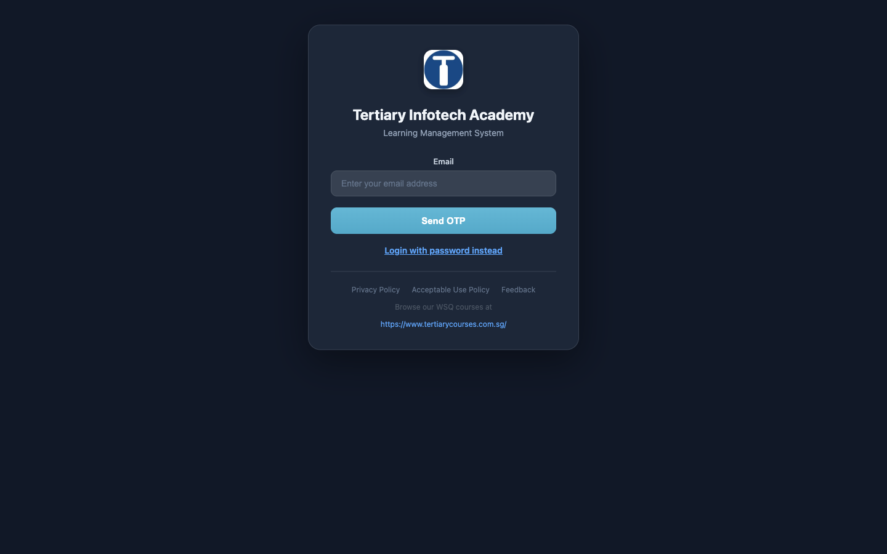

# Admin Guide — Tertiary Infotech Academy (Magento Management System)

Step-by-step "how do I…" guides for the day-to-day running of the
**Tertiary Infotech Academy** course-registration portal (OpenMage 1.x /
Magento 1 LTS). These guides are written for **this specific install** — they use
the real menu paths, field names, store codes, and admin URL of our site, not
generic Magento screenshots.

> **Reminder — this is an LMS, not a shop.** Every "product" is a **course**,
> every "order" is a **registration**, every "customer" is a **learner**. There
> is no stock, shipping, or physical inventory. Ignore any Magento screen that
> talks about weight, quantity-in-stock, or shipping.

## How to log in

| | |
|---|---|
| **Production admin** | <https://www.tertiaryinfotech.edu.sg/tigerdragon/> |
| **Login** | **Email + password** (there is no username field — login is email-only) |
| **Local dev** | <http://localhost:8080/tigerdragon/> |

The admin front name is `tigerdragon`. After login you land on the
**Dashboard**, which is the home of the LMS tools (Manage Courses, Classes,
Users, etc.) in the left sidebar.

> The login screen defaults to **OTP** (one-time code by email). Click
> **"Login with password instead"** to use your email + password.

## The six country stores

One catalog drives six country storefronts. Each has its own domain, currency,
and price. The store **code** (used everywhere in these guides) is:

| Code | Country | Storefront | Currency |
|------|---------|-----------|----------|
| `SG` | 🇸🇬 Singapore | tertiarycourses.com.sg | SGD |
| `MY` | 🇲🇾 Malaysia | tertiarycourses.com.my | MYR |
| `NG` | 🇳🇬 Nigeria | tertiarycourses.com.ng | NGN |
| `GH` | 🇬🇭 Ghana | tertiarycourses.com.gh | GHS |
| `BT` | 🇧🇹 Bhutan | tertiarycourses.bt | BTN |
| `IN` | 🇮🇳 India | tertiarycourses.co.in | INR |

Singapore (SGD) is the **base** store. Course prices are entered once in SGD and
converted into each country's currency (see the currency guide).

## Guides

| Guide | What it covers |
|-------|----------------|
| [Changing the course fee for a course](changing-course-fees.md) | Edit the price of a single course, where it shows up, and how to verify it. |
| [Changing the currency conversion rate](changing-currency-conversion.md) | Update the SGD → MYR/NGN/GHS/BTN/INR exchange rate used to price courses in each country. |

## Conventions used in these guides

- **Path: `System ▸ Configuration ▸ …`** means click the top menu item
  `System`, then the sub-item, and so on.
- Anything in `monospace` is an exact field name, URL, or value to type.
- ⚠️ marks a step you can't skip, or a common mistake.

---
*Maintained alongside the code. If a screen has moved, update the matching guide
in the same pull request.*
