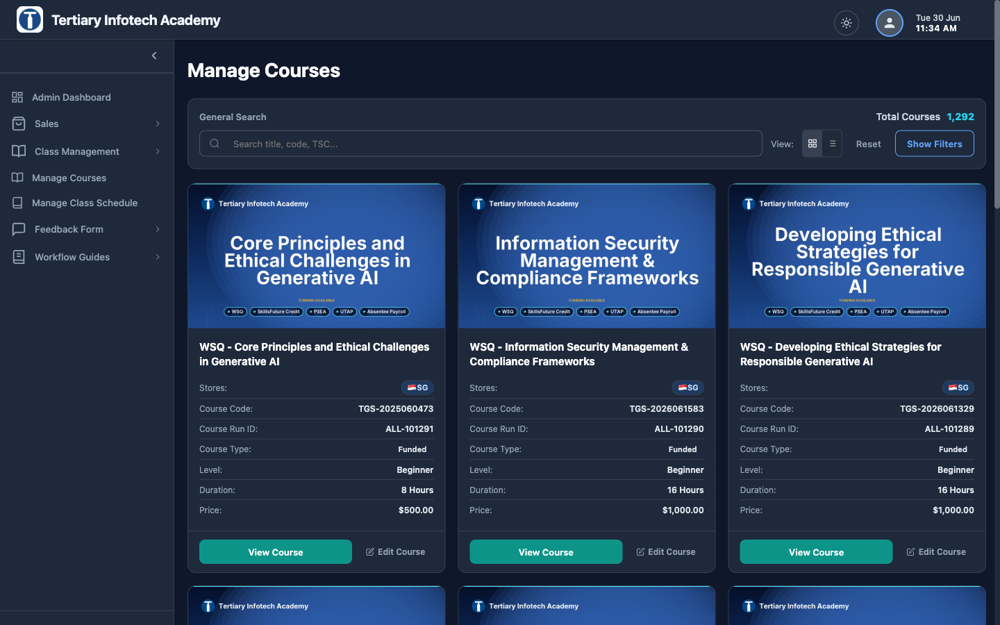
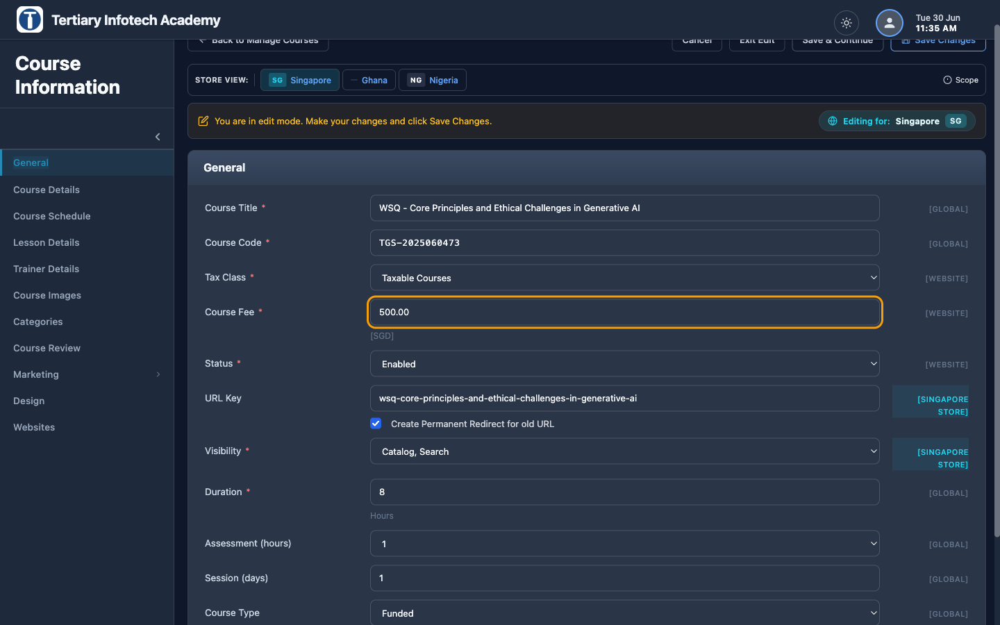

# Changing the Course Fee for a Course

How to change the price of a single course. On this site the course price is
edited from the **Edit Course** page in the Dashboard — **not** from the standard
Magento "Catalog ▸ Manage Products" grid.

> **Scope:** The Course Fee is **website-scoped** — on the Singapore admin you are
> setting the **price in Singapore dollars (SGD)** for the Singapore store (the
> field shows a `[SGD]` and `[WEBSITE]` badge, and the Store View bar reads
> *Editing for: Singapore*). The MY / NG / GH / BT / IN storefronts get their
> price from this SGD value **converted at the exchange rate** — you don't type a
> separate amount per country (see
> [Changing the currency conversion rate](changing-currency-conversion.md)).

---

## Step 1 — Log in to the admin

Go to <https://www.tertiaryinfotech.edu.sg/tigerdragon/> and sign in with your
**email + password**. Select the Developer / Admin role.

## Step 2 — Open Manage Courses

In the left sidebar, click **Manage Courses**.
(Direct link: `…/tigerdragon/admin/dashboard/index?panel=courses`.)

You'll see the course catalog as a grid of cards, each with the course title,
SKU (course code), current price, and a **View Course** / **Edit Course** button.

## Step 3 — Find the course

Use the search box at the top of the Manage Courses panel. You can search by:

- **Course title** — e.g. `Python`
- **Course code / SKU** — e.g. `C6045`, or a WSQ code like `TGS-2021010366`

> SKU prefixes tell you the segment: `TGS-` = SG WSQ course, `C…` = SG non-WSQ
> course, `M…` = other country (MY/NG/GH/BT/IN) course.

## Step 4 — Click "Edit Course"

On the course card, click the **Edit Course** button (pencil icon). This opens
the full **Edit Course** page for that course.

> The URL looks like
> `…/tigerdragon/admin/dashboard/index/course_id/1234/mode/editing`.
> The `course_id` is the internal product ID — you don't need to know it; the
> button fills it in.

## Step 5 — Edit the "Course Fee" field

The Edit Course page opens on the **General** tab. Find the field labelled:

> **Course Fee** `*`

It's a number box (e.g. `500.00`) with a small `[SGD]` hint underneath. This is
the price **in Singapore dollars (SGD)**, excluding GST.

⚠️ Check the **Store View** bar at the top reads **Singapore** (*Editing for:
Singapore* `SG`) before you change the fee — that confirms you're setting the
SGD price. Leave it on Singapore unless you have a deliberate reason to set a
country-specific override.

⚠️ **Enter the fee in SGD only.** Do not type a Malaysian-ringgit or
Nigerian-naira amount here — the country conversion is automatic. Enter the
amount as a plain number with up to two decimals (`1200` or `1200.00`), with **no**
currency symbol and **no** thousands comma.

## Step 6 — Save

Scroll to the bottom (or top) of the Edit Course page and click **Save Changes**.

You'll get a success confirmation and be returned to the course. The save is
handled by our `Coursesave` controller, which writes the new price to the
product and re-saves it.

---

## Where the new fee shows up

After saving, the new fee drives:

- The **course price** on the storefront catalog list and course (product) page.
- The **GST line** — note SG GST is calculated on this **original list price**,
  even for funded/subsidised learners (this is deliberate; see CLAUDE.md).
- The **WSQ funding fee tiles** on SG WSQ course pages — these auto-compute from
  the Course Fee. ⚠️ **Never type funding/subsidy amounts by hand**; they recalc
  from the fee.
- The **per-country price** on MY/NG/GH/BT/IN storefronts, converted from this
  SGD value at the configured exchange rate.

## Step 7 — Verify the change

1. **SG storefront:** open the course page on
   `https://www.tertiarycourses.com.sg/` and confirm the new price (in SGD).
2. **A funded WSQ course (if applicable):** confirm the funding fee tiles
   (above-40 / below-40 / PR / SME) recalculated correctly.
3. **Other countries:** the converted price reaches MY/NG/GH/BT/IN on the next
   catalog sync (runs on a schedule). If you need it live immediately on a
   country site, trigger the course sync for that store rather than waiting.

> **If the SG storefront still shows the old price**, the catalog cache or the
> flat-catalog index may be stale. Re-index **Product Flat Data** (and flush the
> cache) from **System ▸ Index Management**, then re-check. Price edits normally
> reindex on save, but a busy site can lag.

---

## Quick reference

| Item | Value |
|------|-------|
| Where | Dashboard ▸ **Manage Courses** ▸ **Edit Course** ▸ **General** |
| Field | **Course Fee** (`prices_price`) |
| Currency to enter | **SGD**, number only, no symbol/comma |
| Scope | Website (`SGD` on the Singapore store); other countries converted |
| Save button | **Save Changes** |
| Affects | SG price, GST, WSQ funding tiles, all country prices |

## Related

- [Changing the currency conversion rate](changing-currency-conversion.md) — for
  how the SGD fee becomes a MYR/NGN/etc. price.
