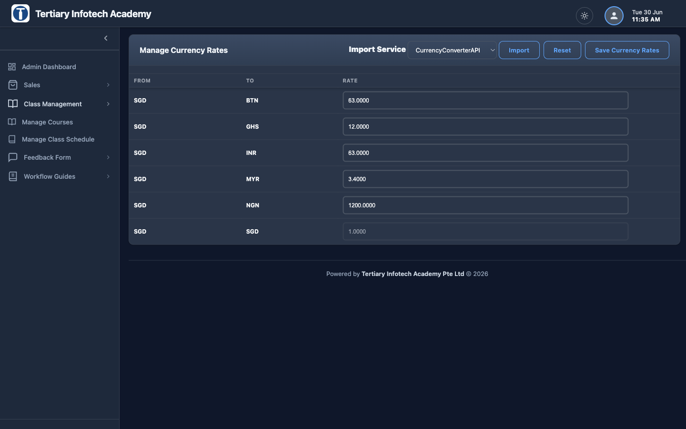

# Changing the Currency Conversion Rate

Course fees are entered **once in Singapore dollars (SGD)** (see
[Changing the course fee](changing-course-fees.md)). Every other country store
shows that price converted into **its own currency** using an exchange rate you
control in the admin.

This guide explains how to change that rate — for example, when the SGD → MYR
rate moves and your Malaysian prices need to follow.

> **The base currency is SGD.** A rate of `3.50` for MYR means
> *1 SGD = 3.50 MYR*, so a `S$1,200` course is priced at `RM4,200` on the
> Malaysian store.

---

## Where the rate lives

The rate is the standard Magento **currency rate** (`directory_currency_rate`).
Our course-sync reads it via `directory/currency ▸ getRate()` and sends each
country instance its price **already converted**, so the rate you set here is the
single source of truth for every country's pricing.

| Base | Target currencies you may set |
|------|-------------------------------|
| `SGD` | `MYR` (Malaysia), `NGN` (Nigeria), `GHS` (Ghana), `BTN` (Bhutan), `INR` (India) |

---

## Step 1 — Log in to the **Singapore** admin

Go to <https://www.tertiaryinfotech.edu.sg/tigerdragon/> and sign in.
⚠️ Rates are managed on the **SG (base)** admin — that's where prices originate.

## Step 2 — Open Manage Currency Rates

Top menu: **System ▸ Manage Currency Rates**.

You'll see a table with a **FROM** column (always `SGD`), a **TO** column (each
target currency), and an editable **RATE** box per row.



A typical set of rates looks like this (yours will differ with the market):

| FROM | TO | RATE | Meaning |
|------|----|------|---------|
| SGD | BTN | `63.0000` | 1 SGD = 63 Bhutanese ngultrum |
| SGD | GHS | `12.0000` | 1 SGD = 12 Ghanaian cedi |
| SGD | INR | `63.0000` | 1 SGD = 63 Indian rupee |
| SGD | MYR | `3.4000` | 1 SGD = 3.40 Malaysian ringgit |
| SGD | NGN | `1200.0000` | 1 SGD = 1,200 Nigerian naira |
| SGD | SGD | `1.0000` | base — never change |

> If a target currency row is missing, it isn't enabled yet — see
> [Enabling a new currency](#enabling-a-new-currency-first-time-only) below.

## Step 3 — Type the new rate

Find the row for the currency you want to change (e.g. the `SGD → MYR` row) and
type the new rate into its **RATE** box, for example `3.5000`.

Repeat for any other currencies you need to update. Use a plain decimal number
(no symbols).

> **Sanity check the direction.** Because SGD is the strongest of these
> currencies, every rate should be **greater than 1** (1 SGD buys many MYR / NGN
> / GHS / INR). A rate like `0.28` would be upside-down and make courses look
> almost free.

## Step 4 — Save

Click **Save Currency Rates** (top-right). You'll get a success message.

> **Import rates automatically (optional):** the same page has an
> *"Import Currency Rates"* control that pulls live rates from an online service.
> We normally set rates **manually** so prices stay round and predictable — only
> use Import if you specifically want live market rates.

## Step 5 — Push the new prices to the country stores

Changing the rate updates how SG **exports** prices, but each country site keeps
its own copy of the catalog. The new prices reach them when the **course sync**
runs:

- **Automatic:** the catalog sync runs on a schedule — the country stores pick up
  the re-priced courses on the next run.
- **Backfill an existing catalog immediately:** to re-price **all already-synced
  courses** on a country instance right away, run the maintenance script **on
  that country's instance**:

  ```bash
  # On the target country instance (e.g. Malaysia). Dry-run first:
  php scripts/maintenance/backfill-country-price-conversion.php
  # Then apply:
  php scripts/maintenance/backfill-country-price-conversion.php --apply
  ```

  It fetches every SG price converted to the local currency and writes it to that
  country's website-scoped price. The dry run prints what *would* change so you
  can eyeball it before `--apply`.

---

## Step 6 — Verify

1. **SG store is unaffected** — `tertiarycourses.com.sg` still shows SGD prices
   (the SGD→SGD rate is always `1`). ✅ Changing MYR/NGN/etc. never moves SG
   prices.
2. **Country store updated** — open a course on the changed country's domain
   (e.g. `https://www.tertiarycourses.com.my/`) and confirm the price equals
   `SGD price × new rate`.
   - Example: `S$1,200 × 3.50 = RM4,200`.
3. If the country price hasn't moved, the sync hasn't run yet — wait for the
   scheduled sync or run the backfill script above on that instance.

> **If a country price stays in SGD numbers** (e.g. a Ghana course showing
> `1,200` instead of a converted cedi amount), that store was synced **before**
> the rate existed. Run the backfill script on that instance to fix it.

---

## Enabling a new currency (first time only)

If a target currency column doesn't appear on the Manage Currency Rates page, it
isn't in the allowed-currencies list yet:

1. **System ▸ Configuration ▸ General ▸ Currency Setup.**
2. Set the **scope** (top-left dropdown) to the country's **website**.
3. Under **Currency Options**:
   - **Base currency** = that country's currency (e.g. `Malaysian Ringgit`).
   - **Default display currency** = the same currency.
   - **Allowed currencies** = include that currency.
4. **Save Config.**
5. Return to **System ▸ Manage Currency Rates** — the new column now appears.
   Set its rate per the steps above.

---

## Quick reference

| Item | Value |
|------|-------|
| Where | **System ▸ Manage Currency Rates** (on the **SG** admin) |
| Base currency | `SGD` (never change this) |
| Meaning of rate | `3.50` for MYR = 1 SGD → 3.50 MYR |
| Rule of thumb | All rates **> 1** (SGD is the strongest) |
| Save button | **Save Currency Rates** |
| Propagation | Course sync (scheduled) or `backfill-country-price-conversion.php --apply` on the country instance |
| SG price impact | **None** — SG always SGD |

## Related

- [Changing the course fee for a course](changing-course-fees.md) — set the SGD
  base price that this rate converts.
